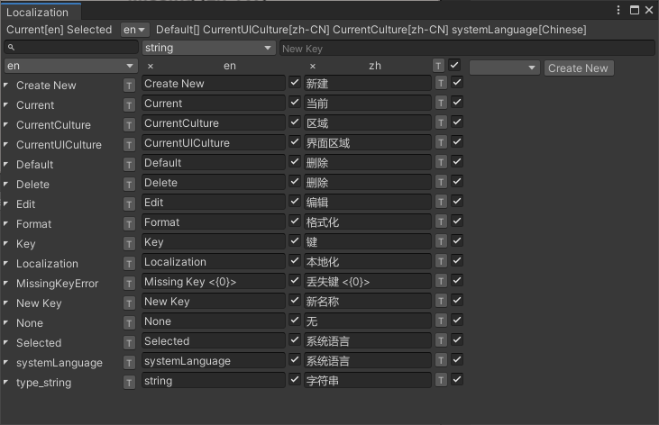
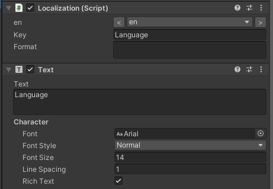

# 本地化

资源本地化，多语言配置


## 预览






## 菜单

###### Window/General

- Localization

  打开本地化编辑器


## 如何打开

两种打开方式

- 双击 `*.lang.xml`  文件显示本地化编辑器
- 或者点击菜单 `Window/General/Localization`


## 添加本地化文件

1. 打开本地化编辑器
2. 点击 `新建` 按钮，弹出新建文件框
3. 选择文件夹 `Assets/Resources/Localization`
4. 输入[语言代码](#语言代码)，比如：zh(中文)，en(英文)
5. 点击 `保存` 按钮将创建 `*.lang.xml`文件


## 使用

1. 继承 `DefaultLocalizationValues` 实现本地化语言字符串字典

2. 初始化

   ```
   Localization.Initialize();
   ```

3. 获取本地化字符串

   ```C#
   "Hello World".Localization()
   ```

   


## 本地化编辑器

**[当前]  [选择的]  [默认]  [界面区域]  [区域]  [系统语言]**

优先级依次

- 当前

  当前运行时所使用的语言

- 选择的

  用户指定的语言，优先级最高

  ```c#
  Localization.SelectedLang
  ```

- 默认

  用户设置的默认语言

  ```
  Localization.DefaultLang
  ```

- 界面区域

  线程区域界面语言

  ```c#
  Thread.CurrentThread.CurrentUICulture
  ```

- 区域

  线程区域语言

  ```c#
  Thread.CurrentThread.CurrentCulture
  ```

- 系统语言

  ```c#
  UnityEngine.Application.systemLanguage
  ```

  


**<[基础语言代码](#语言代码)> 编辑按钮 <[当前语言代码](#语言代码)> 编辑[<[语言代码](#语言代码)>]按钮 新建按钮 *按钮**

- 基础语言代码

  基础配置文件，获取键值

- 编辑按钮

  切换到基础文件编辑

- 当前语言代码

  当前编辑的文件

- 编辑[[语言代码](#语言代码)]按钮

  切换到语言代码文件编辑

- 新建按钮

  新建配置文件

- *按钮

  跳转到当前文件

- 新名称输入框

  新增语言键值，输入后按回车添加

- 数据类型

  默认字符串类型

- 键值名称

  - 点击复制名称
  - 双击编辑名称

- 复选框

  未勾选表示继承基础值

- 菜单

  - 删除

    删除该项


## 编辑器GUI使用本地化


   ```c#
private static LocalizationValues editorLocalizationValues;
public static LocalizationValues EditorLocalizationValues
{
	get
    {
    	if (editorLocalizationValues == null)
			editorLocalizationValues = new DirectoryLocalizationValues("<(*.lang.xml)文件夹路径>"));
			return editorLocalizationValues;
	}
}
   
void OnGUI(){
    using (Localization.BeginScope(EditorBuildData.EditorLocalizationValues))
    {
        //"<Key>".Localization()        
    }
}
   
   ```

   

**翻译提示词**

```
保持文件格式不变，将 string 标签内的文本翻译成 英语
```


## 语言代码

### 格式

```
语言-区域
```

- 语言

  小写

- 区域

  可选，大写


### 语言代码表

| 语言名称 | 语言                | 原文名                | Unity              | Steam      | Unicode   |
| -------- | ------------------- | --------------------- | ------------------ | ---------- | --------- |
| ar       | 阿拉伯语            | العربية               |                    | arabic     |           |
| bg       | 保加利亚语          | български език        |                    | bulgarian  |           |
| de       | 德语                | Deutsch               | German             | german     |           |
| en       | 英语                | English               | English            | english    |           |
| en-US    | 英语 - 美国         |                       |                    |            |           |
| cs       | 捷克语              | čeština               |                    | czech      |           |
| da       | 丹麦语              | Dansk                 |                    | danish     |           |
| nl       | 荷兰语              | Nederlands            |                    | dutch      |           |
| fi       | 芬兰语              | Suomi                 |                    | finnish    |           |
| fr       | 法语                | Français              | French             | french     |           |
| it       | 意大利语            | Italiano              | Italian            | italian    |           |
| ja       | 日语                | 日本語                | Japanese           | japanese   |           |
| ko       | 韩语                | 한국어                | Korean             | koreana    |           |
| ru       | 俄语                | Русский               | Russian            | russian    |           |
| zh       | 中文简体            | 简体中文              | Chinese            |            |           |
| zh-CN    | 简体中文            | 简体中文              | ChineseSimplified  | schinese   |           |
| zh-TW    | 繁体中文 - 台湾     | 繁體中文              | ChineseTraditional | tchinese   |           |
| pl       | 波兰语              | Polski                |                    | polish     |           |
| pt       | 葡萄牙语            | Português             | Portuguese         | portuguese |           |
| pt-BR    | 葡萄牙语 - 巴西     | Português-Brasil      |                    | brazilian  |           |
| ru       | 罗马尼亚语          | Română                |                    | romanian   |           |
| el       | 希腊语              | Ελληνικά              |                    | greek      |           |
| hu       | 匈牙利语            | Magyar                | Hungarian          | hungarian  |           |
| no       | 挪威语              | Norsk                 |                    | norwegian  |           |
| id       | 印度尼西亚语        | Bahasa Indonesia      |                    | indonesian |           |
| es       | 西班牙语 - 西班牙   | Español-España        | Spanish            | spanish    |           |
| es-419   | 西班牙语 - 拉丁美洲 | Español-Latinoamérica |                    | latam      |           |
| sv       | 瑞典语              | Svenska               |                    | swedish    |           |
| th       | 泰语                | ไทย                   |                    | thai       | 0E00-0E7F |
| tr       | 土耳其语            | Türkçe                |                    | turkish    |           |
| uk       | 乌克兰语            | Українська            |                    | ukrainian  |           |
| vi       | 越南语              | Tiếng Việt            |                    | vietnamese | AB00-AB5F |


[语言代码缩写表](https://en.wikipedia.org/wiki/List_of_ISO_639-1_codes )

[Steam 支持的语言表](https://partner.steamgames.com/doc/store/localization/languages)


朝鲜语， msyh.ttc 不支持，朝鲜语现有11172个音节可用，[音节列表](https://zh.wikipedia.org/wiki/%E8%AB%BA%E6%96%87)

日语，[日文五十音](https://www.gaya.org.tw/library/classify/author-jp.htm)

TTC（TrueType Collection）是一种集成多字体的文件格式，通过将多个TrueType或OpenType字体组合成单一文件

TTF （TrueType Font）采用二次贝塞尔曲线描述字符轮廓的矢量格式，支持无限缩放并具备跨平台兼容性


## Unicode 范围

0000-007F：C0控制符及基本拉丁文 (C0 Control and Basic Latin)

0080-00FF：C1控制符及拉丁文补充-1 (C1 Control and Latin 1 Supplement)

0100-017F：拉丁文扩展-A (Latin Extended-A)

0180-024F：拉丁文扩展-B (Latin Extended-B)

0250-02AF：国际音标扩展 (IPA Extensions)

02B0-02FF：空白修饰字母 (Spacing Modifiers)

0300-036F：结合用读音符号 (Combining Diacritics Marks)

0370-03FF：希腊文及科普特文 (Greek and Coptic)

0400-04FF：西里尔字母 (Cyrillic)

0500-052F：西里尔字母补充 (Cyrillic Supplement)

0530-058F：亚美尼亚语 (Armenian)

0590-05FF：希伯来文 (Hebrew)

0600-06FF：阿拉伯文 (Arabic)

0700-074F：叙利亚文 (Syriac)

0750-077F：阿拉伯文补充 (Arabic Supplement)

0780-07BF：马尔代夫语 (Thaana)

07C0-077F：西非書面語言 (N’Ko)

0800-085F：阿维斯塔语及巴列维语 (Avestan and Pahlavi)

0860-087F：Mandaic

0880-08AF：撒马利亚语 (Samaritan)

0900-097F：天城文书 (Devanagari)

0980-09FF：孟加拉语 (Bengali)

0A00-0A7F：锡克教文 (Gurmukhi)

0A80-0AFF：古吉拉特文 (Gujarati)

0B00-0B7F：奥里亚文 (Oriya)

0B80-0BFF：泰米尔文 (Tamil)

0C00-0C7F：泰卢固文 (Telugu)

0C80-0CFF：卡纳达文 (Kannada)

0D00-0D7F：德拉维族语 (Malayalam)

0D80-0DFF：僧伽罗语 (Sinhala)

0E00-0E7F：泰文 (Thai)

0E80-0EFF：老挝文 (Lao)

0F00-0FFF：藏文 (Tibetan)

1000-109F：缅甸语 (Myanmar)

10A0-10FF：格鲁吉亚语 (Georgian)

1100-11FF：朝鲜文 (Hangul Jamo)

1200-137F：埃塞俄比亚语 (Ethiopic)

1380-139F：埃塞俄比亚语补充 (Ethiopic Supplement)

13A0-13FF：切罗基语 (Cherokee)

1400-167F：统一加拿大土著语音节 (Unified Canadian Aboriginal Syllabics)

1680-169F：欧甘字母 (Ogham)

16A0-16FF：如尼文 (Runic)

1700-171F：塔加拉语 (Tagalog)

1720-173F：Hanunóo

1740-175F：Buhid

1760-177F：Tagbanwa

1780-17FF：高棉语 (Khmer)

1800-18AF：蒙古文 (Mongolian)

18B0-18FF：Cham

1900-194F：Limbu

1950-197F：德宏泰语 (Tai Le)

1980-19DF：新傣仂语 (New Tai Lue)

19E0-19FF：高棉语记号 (Kmer Symbols)

1A00-1A1F：Buginese

1A20-1A5F：Batak

1A80-1AEF：Lanna

1B00-1B7F：巴厘语 (Balinese)

1B80-1BB0：巽他语 (Sundanese)

1BC0-1BFF：Pahawh Hmong

1C00-1C4F：雷布查语(Lepcha)

1C50-1C7F：Ol Chiki

1C80-1CDF：曼尼普尔语 (Meithei/Manipuri)

1D00-1D7F：语音学扩展 (Phonetic Extensions)

1D80-1DBF：语音学扩展补充 (Phonetic Extensions Supplement)

1DC0-1DFF：结合用读音符号补充 (Combining Diacritics Marks Supplement)

1E00-1EFF：拉丁文扩充附加 (Latin Extended Additional)

1F00-1FFF：希腊语扩充 (Greek Extended)

2000-206F：常用标点 (General Punctuation)

2070-209F：上标及下标 (Superscripts and Subscripts)

20A0-20CF：货币符号 (Currency Symbols)

20D0-20FF：组合用记号 (Combining Diacritics Marks for Symbols)

2100-214F：字母式符号 (Letterlike Symbols)

2150-218F：数字形式 (Number Form)

2190-21FF：箭头 (Arrows)

2200-22FF：数学运算符 (Mathematical Operator)

2300-23FF：杂项工业符号 (Miscellaneous Technical)

2400-243F：控制图片 (Control Pictures)

2440-245F：光学识别符 (Optical Character Recognition)

2460-24FF：封闭式字母数字 (Enclosed Alphanumerics)

2500-257F：制表符 (Box Drawing)

2580-259F：方块元素 (Block Element)

25A0-25FF：几何图形 (Geometric Shapes)

2600-26FF：杂项符号 (Miscellaneous Symbols)

2700-27BF：印刷符号 (Dingbats)

27C0-27EF：杂项数学符号-A (Miscellaneous Mathematical Symbols-A)

27F0-27FF：追加箭头-A (Supplemental Arrows-A)

2800-28FF：盲文点字模型 (Braille Patterns)

2900-297F：追加箭头-B (Supplemental Arrows-B)

2980-29FF：杂项数学符号-B (Miscellaneous Mathematical Symbols-B)

2A00-2AFF：追加数学运算符 (Supplemental Mathematical Operator)

2B00-2BFF：杂项符号和箭头 (Miscellaneous Symbols and Arrows)

2C00-2C5F：格拉哥里字母 (Glagolitic)

2C60-2C7F：拉丁文扩展-C (Latin Extended-C)

2C80-2CFF：古埃及语 (Coptic)

2D00-2D2F：格鲁吉亚语补充 (Georgian Supplement)

2D30-2D7F：提非纳文 (Tifinagh)

2D80-2DDF：埃塞俄比亚语扩展 (Ethiopic Extended)

2E00-2E7F：追加标点 (Supplemental Punctuation)

2E80-2EFF：CJK 部首补充 (CJK Radicals Supplement)

2F00-2FDF：康熙字典部首 (Kangxi Radicals)

2FF0-2FFF：表意文字描述符 (Ideographic Description Characters)

3000-303F：CJK 符号和标点 (CJK Symbols and Punctuation)

3040-309F：日文平假名 (Hiragana)

30A0-30FF：日文片假名 (Katakana)

3100-312F：注音字母 (Bopomofo)

3130-318F：朝鲜文兼容字母 (Hangul Compatibility Jamo)

3190-319F：象形字注释标志 (Kanbun)

31A0-31BF：注音字母扩展 (Bopomofo Extended)

31C0-31EF：CJK 笔画 (CJK Strokes)

31F0-31FF：日文片假名语音扩展 (Katakana Phonetic Extensions)

3200-32FF：封闭式 CJK 文字和月份 (Enclosed CJK Letters and Months)

3300-33FF：CJK 兼容 (CJK Compatibility)

3400-4DBF：CJK 统一表意符号扩展 A (CJK Unified Ideographs Extension A)

4DC0-4DFF：易经六十四卦符号 (Yijing Hexagrams Symbols)

4E00-9FBF：CJK 统一表意符号 (CJK Unified Ideographs)

A000-A48F：彝文音节 (Yi Syllables)

A490-A4CF：彝文字根 (Yi Radicals)

A500-A61F：Vai

A660-A6FF：统一加拿大土著语音节补充 (Unified Canadian Aboriginal Syllabics Supplement)

A700-A71F：声调修饰字母 (Modifier Tone Letters)

A720-A7FF：拉丁文扩展-D (Latin Extended-D)

A800-A82F：Syloti Nagri

A840-A87F：八思巴字 (Phags-pa)

A880-A8DF：Saurashtra

A900-A97F：爪哇语 (Javanese)

A980-A9DF：Chakma

AA00-AA3F：Varang Kshiti

AA40-AA6F：Sorang Sompeng

AA80-AADF：Newari

AB00-AB5F：越南傣语 (Vi?t Thái)

AB80-ABA0：Kayah Li

AC00-D7AF：朝鲜文音节 (Hangul Syllables)

D800-DBFF：High-half zone of UTF-16

DC00-DFFF：Low-half zone of UTF-16

E000-F8FF：自行使用區域 (Private Use Zone)

F900-FAFF：CJK 兼容象形文字 (CJK Compatibility Ideographs)

FB00-FB4F：字母表達形式 (Alphabetic Presentation Form)

FB50-FDFF：阿拉伯表達形式A (Arabic Presentation Form-A)

FE00-FE0F：变量选择符 (Variation Selector)

FE10-FE1F：竖排形式 (Vertical Forms)

FE20-FE2F：组合用半符号 (Combining Half Marks)

FE30-FE4F：CJK 兼容形式 (CJK Compatibility Forms)

FE50-FE6F：小型变体形式 (Small Form Variants)

FE70-FEFF：阿拉伯表達形式B (Arabic Presentation Form-B)

FF00-FFEF：半型及全型形式 (Halfwidth and Fullwidth Form)

FFF0-FFFF：特殊 (Specials)