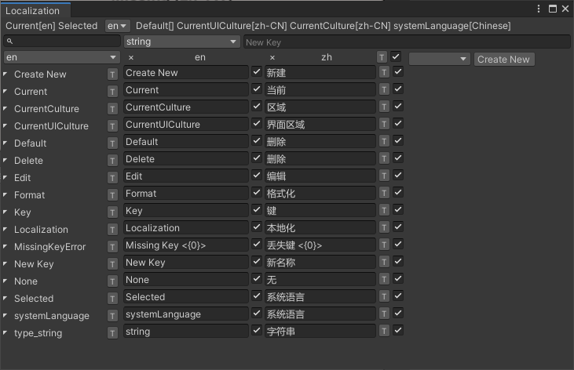
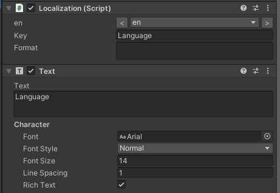

# Unity Localization

本地化


## manifest.json


   ```
"unity.guiextensions": "https://github.com/liuwenjiexx/Unity.GuiExtensions.git",
"unity.localization": "https://github.com/liuwenjiexx/Unity.Localization.git?path=/Assets/Plugins/Unity.Localization",
   ```


## 预览







## 快速使用

2. 打开Unity 双击 `Assets/Example/ResourcesLoad/Localization/*.lang.xml` 

3. 运行样例场景 `Assets/Example`


#### [**详细说明**](Assets/Plugins/Unity.Localization/README.md)

